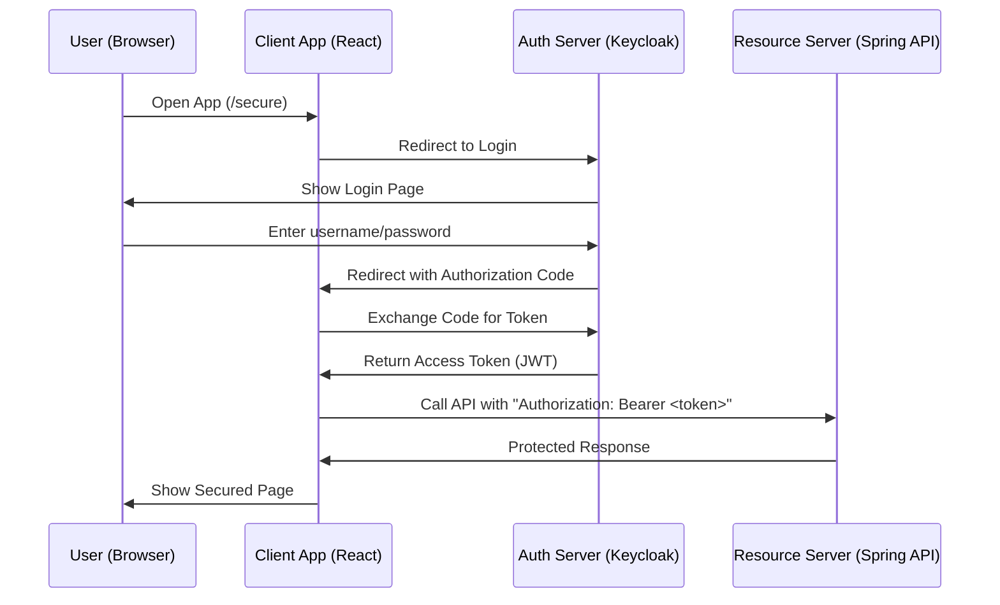
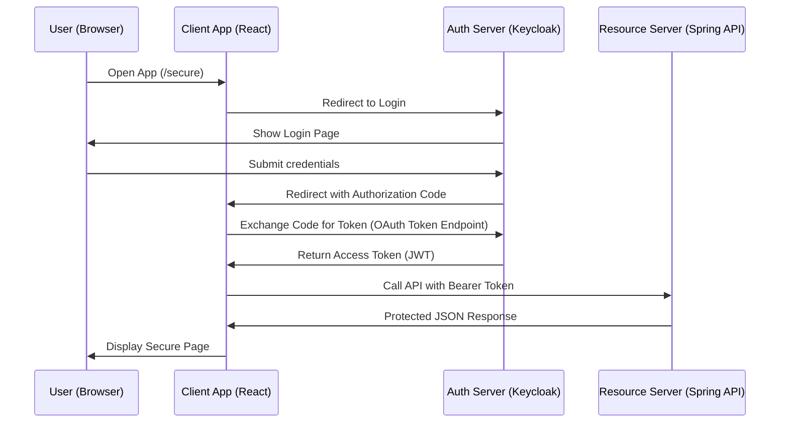

# 🛡️ What Is OAuth2 (Explained Simple)

**OAuth2** is a secure way for apps to let users **log in** and **access APIs** *without passing usernames and passwords around.*

It separates the system into **three parts**:

1. **Authorization Server**

   * Example: **Keycloak**, Google Login, Facebook Login
   * Handles login, passwords, MFA
   * Issues **tokens** (like a secure badge)

2. **Client Application** (your app / frontend)

   * Example: **React app**
   * Sends the user to the login page
   * Receives a token afterward
   * Uses token to call backend API

3. **Resource Server**

   * Example: **Spring Boot API**
   * Holds the protected data
   * Checks the token
   * Allows or denies access based on roles/permissions

---

# 🧠 How OAuth2 Works (Simple Version)

Here is the **simplest flow** called **Authorization Code Flow** (the one used by browsers + SPAs).

### 1. User tries to access your app

### 2. Your app redirects them to the login server (Keycloak)

### 3. User logs in

### 4. Keycloak redirects back with an "authorization code"

### 5. Your app exchanges the code for a **token**

### 6. Your app calls the API using the **token**

### 7. API checks the token and returns data

---

# 🔐 ASCII Diagram — OAuth2 Flow

```
+----------------+         +-----------------+         +------------------+
|                |         |                 |         |                  |
|   User /       |  (1)    |   Client App    | (6)     |  Resource Server |
|  Browser App   +-------->+  (React, etc)   +-------->+ (Spring Boot API)|
|                |         |                 |         |                  |
+-------+--------+         +--------+--------+         +---------+--------+
        ^                           |                            ^
        |                           |                            |
        | (4) authorization code    | (7) API Response           |
        |                           |                            |
+-------+--------+         +--------v--------+                   
|                | (3)     |                 | (5)               
| Authorization  +-------->+   Keycloak      +-------------------+
|    Server      |         | (Login Server)  |   Tokens (JWT)    
|                |         |                 |                   
+----------------+         +-----------------+               
```

---

# 🌈 Markdown Mermaid Diagram (Pretty Version)

You can paste this directly into GitHub or Markdown tools:



---

# 🔑 Key OAuth2 Concepts (Simple Bullet Points)

### ✔️ **Access Token (JWT)**

* Like a **digital ID badge**
* Contains:

  * Username
  * Roles
  * Expiration time
* Sent to API in the header:

  ```
  Authorization: Bearer <token>
  ```

### ✔️ **Authorization Server**

* Handles login/password
* Issues access tokens
* Example: **Keycloak**

### ✔️ **Client**

* The app the user interacts with (React)
* Never stores passwords
* Only handles tokens

### ✔️ **Resource Server**

* API that returns protected data
* Validates JWT tokens
* Checks user roles with expressions like:

  ```
  @PreAuthorize("hasRole('ADMIN')")
  ```

### ✔️ **Scopes**

* Fine-grained permissions like:

  * `read`
  * `write`
  * `openid`
* Used mainly when third-party apps request permissions

### ✔️ **Redirect URI**

* Where Keycloak sends the user after login
* Must match exactly (including port)

### ✔️ **Authorization Code**

* A temporary code returned after login
* The client uses it to get the token

---

# 🔒 Why OAuth2 Is Safer Than Passing Passwords

* Passwords are **never sent to the app**
* Only Keycloak handles login
* The app only sees **tokens**
* Tokens expire → safer if stolen
* Roles are included inside the token → API doesn't need a database lookup

---
Below is a **complete, professional, copy-paste-ready `README.md`** for your project.

It explains **OAuth2**, **Keycloak**, **React client**, **Spring Boot resource server**, includes **ASCII diagrams**, a **Mermaid diagram**, and clear **step-by-step setup instructions** for running the ZIP you uploaded.

If you want, I can **insert your project’s exact file names**, or **tailor it to GitHub**, or **add screenshots**.

---

# README.md

# 🔐 OAuth2 + Keycloak + Spring Boot + React

### Simple Beginner-Friendly Example

This project demonstrates a **complete end-to-end OAuth2 setup** using:

* **Keycloak** → Authorization Server (login + JWT tokens)
* **Spring Boot API** → Resource Server (secured endpoints)
* **React SPA** → OAuth2 Client (login + call API)

The goal is to show **exactly how OAuth2 works** using the simplest possible architecture.

---

# 📦 Project Contents

This project contains three main pieces:

```
/keycloak      → (Configured externally)
/spring-api    → Spring Boot 3.5.x Resource Server (JWT)
/react-app     → React + keycloak-js client (Vite)
```

The ZIP includes:

* Java Spring API with:

  * SecurityConfig
  * HelloController (role-protected endpoints)
  * AuthController (force login)
  * CORS configuration

* React App with:

  * AuthContext
  * ProtectedRoute
  * keycloak.js
  * SecurePage
  * API service with Bearer token
  * Inactivity timer

---

# 🌈 Overview — What You Are Building

OAuth2 works by **separating login from your app**, so your app never handles passwords.

* 🔐 **Keycloak** handles login
* 🎨 **React App** requests tokens
* 🧠 **Spring Boot** checks tokens and roles
* 🔒 Roles decide access to certain endpoints

---

# 🛡️ OAuth2 Explained (Super Simple)

OAuth2 is like using a **security badge** to access different rooms:

* Keycloak gives you the badge (token)
* React app carries the badge
* Spring Boot API checks the badge before letting you in

---

# 🧱 OAuth2 Roles in This Example

Keycloak realm roles you need to create:

* `USER`
* `ADMIN`
* `UPLOAD`

They map to Spring as:

```
ROLE_USER
ROLE_ADMIN
ROLE_UPLOAD
```

Spring endpoints:

| Endpoint           | Required Role |
| ------------------ | ------------- |
| `/api/hello`       | USER          |
| `/api/hello/admin` | ADMIN         |
| `/api/hello/user`  | UPLOAD        |

---

# 🧭 OAuth2 Authorization Code Flow (Step-by-Step)

1. User opens React app
2. React redirects to Keycloak login
3. User logs in
4. Keycloak redirects back with an authorization **code**
5. React + keycloak-js exchange that code for a **token (JWT)**
6. React calls Spring API with

   ```
   Authorization: Bearer <token>
   ```
7. Spring validates token + roles
8. Data is returned to the React app

---

# 🖼️ ASCII Diagram — OAuth2 Flow

```
+----------------+         +-----------------+         +------------------+
|                |         |                 |         |                  |
|   User /       |  (1)    |   Client App    | (6)     |  Resource Server |
|  Browser App   +-------->+  (React SPA)    +-------->+ (Spring Boot API)|
|                |         |                 |         |                  |
+-------+--------+         +--------+--------+         +---------+--------+
        ^                           |                            ^
        |                           |                            |
        | (4) authorization code    | (7) API Response           |
        |                           |                            |
+-------+--------+         +--------v--------+                   
|                | (3)     |                 | (5)               
| Authorization  +-------->+   Keycloak      +-------------------+
|    Server      |         | (Login Server)  |   Tokens (JWT)    
|                |         |                 |                   
+----------------+         +-----------------+               
```

---

# 🎨 Mermaid Diagram Version (Beautiful Markdown)



---

# ⚙️ Key Concepts (Bullet-Point Cheatsheet)

## 🔑 Access Token (JWT)

* Secure token with:

  * username
  * roles
  * expiration
* Sent to API:

  ```
  Authorization: Bearer <token>
  ```

## 🚪 Roles (Permissions)

* Assigned in Keycloak
* Example: USER / ADMIN / UPLOAD
* Checked in Spring Boot via:

  ```
  @PreAuthorize("hasRole('ADMIN')")
  ```

## 🔒 Resource Server (Spring Boot)

* Validates JWT signature
* Validates issuer (`demo-realm`)
* Maps roles from the token

## 🧠 Client (React)

* Uses `keycloak-js`
* Handles login redirects
* Stores token in memory (secure)
* Calls API using the token

## 🌍 CORS

Needed because:

* React = `http://localhost:5173`
* API = `http://localhost:8080`

Configured in Spring:

```
.allowedOrigins("http://localhost:5173")
.allowCredentials(true)
```

---

# 🚀 Setup Guide (Step-by-Step)

This section explains how to **run the whole project**, starting with Keycloak.

---

## 1️⃣ Start Keycloak (Login Server)

### Create Realm

* Name: **demo-realm**

### Create Roles

* `USER`
* `ADMIN`
* `UPLOAD`

### Create Test User

* username: `testuser`
* password: `password`
* assign roles (`USER` at minimum)

### Create Client

* Client ID: **demo-client**
* Valid redirect URIs:

  ```
  http://localhost:5173/*
  ```
* Web Origins:

  ```
  http://localhost:5173
  ```
* Enable **Standard Flow**

---

## 2️⃣ Start Spring Boot API

Requirements:

* Java 21
* Maven

Run:

```
cd spring-api
mvn spring-boot:run
```

API will run on:

```
http://localhost:8080
```

Endpoints:

* `/api/hello`
* `/api/hello/admin`
* `/api/hello/user`

Each requires different roles.

---

## 3️⃣ Start React App

Requirements:

* Node 18+
* Vite

Run:

```
cd react-app
npm install
npm run dev
```

App runs at:

```
http://localhost:5173
```

Navigate to `/login`.

---

# 🔥 Testing the Whole System

1. Open browser → `http://localhost:5173/secure`
2. You will be redirected to Keycloak
3. Login using your test user
4. React loads user info & roles
5. Click buttons to call secured endpoints
6. Spring responds based on your roles

---

# 🧪 Example API Calls

### Check “Hello” (requires role USER)

```
GET /api/hello
Authorization: Bearer <jwt>
```

### Check “Admin” (requires role ADMIN)

```
GET /api/hello/admin
Authorization: Bearer <jwt>
```

---

# 🔧 File Structure Example

```
spring-api/
  ├─ src/main/java/com/example/security/SecurityConfig.java
  ├─ src/main/java/com/example/controller/HelloController.java
  ├─ src/main/java/com/example/controller/AuthController.java
  ├─ src/main/resources/application.properties

react-app/
  ├─ src/AuthContext.jsx
  ├─ src/ProtectedRoute.jsx
  ├─ src/keycloak.js
  ├─ src/SecurePage.jsx
  ├─ src/apiService.js
  ├─ src/InactivityTimer.jsx
```

---

# 📘 Why Use OAuth2 (Instead of Sessions)

* No passwords sent through your apps
* Token is trusted and signed
* APIs don’t need to store sessions
* Roles included in token
* Works across multiple services

---

# 🎉 Conclusion

You now have a **complete OAuth2 ecosystem**:

| Component           | Purpose                        |
| ------------------- | ------------------------------ |
| **Keycloak**        | Authenticates + issues tokens  |
| **React Client**    | Logs in user + stores token    |
| **Spring Boot API** | Validates JWT + enforces roles |

This project is a solid foundation for:

* Microservices
* Role-based access
* Enterprise authentication
* Secure APIs
* Single Sign-On (SSO)

Below is a **clear, simple explanation** of:

* **Man-in-the-Middle (MITM) attacks**
* **Session expiration**
* **Token refresh**
* **How OAuth2 + Keycloak + HTTPS protects you**
* **What you must configure to stay safe**

This version is beginner-friendly **and** technically correct — perfect for a README or training document.

---

# 🔐 1. Man-in-the-Middle (MITM) Attacks

## ❌ What is a MITM attack?

A **Man-in-the-Middle attack** happens when a hacker secretly intercepts communication between:

* The browser (React app)
* The Authorization Server (Keycloak)
* The Resource Server (Spring API)

The attacker tries to:

1. **Steal tokens**
2. **Modify requests**
3. **Pretend to be the user**

Example:

```
User → (attacker intercepts) → Keycloak
```

If the attacker can steal your JavaScript-accessible token, they can use it until it expires.

---

## ✔️ How OAuth2 prevents MITM

OAuth2 *by itself* does **not** stop MITM —
**HTTPS does**.

### 🔐 HTTPS (TLS/SSL) stops MITM

When you use:

```
https://my-api.com
https://my-login.com
```

Traffic is encrypted end-to-end.

Without HTTPS:

* Tokens can be stolen
* Passwords can be intercepted
* Redirect URL can be altered

### ✔ Keycloak + Spring Boot REQUIRE HTTPS in production

**Never deploy OAuth2 on plain HTTP.**

Configure:

* In React:

  ```js
  url: "https://auth.mycompany.com"
  ```

* In Keycloak:
  Settings → Realm → “Require HTTPS”

* In Spring Boot (`application.yml`):

  ```yaml
  server:
    ssl:
      enabled: true
  ```

---

## ✔ Additional MITM Protections

### 1. **PKCE (Proof Key for Code Exchange)**

You already enabled:

```js
pkceMethod: "S256"
```

PKCE prevents attackers from stealing authorization codes.

### 2. **Secure Cookies (if used)**

Set:

* `Secure`
* `SameSite=strict`
* `HttpOnly` (for non-SPA clients)

### 3. **CORS**

Prevents malicious websites from using your tokens:

```
allowedOrigins("https://my-frontend.com")
```

---

# ⏰ 2. Session Expiration

## ❌ What is session expiration?

A session expiration ensures:

* Users are logged out after inactivity
* Stolen tokens become useless
* MITM attackers can’t reuse old sessions

OAuth2 has 3 relevant expirations:

| Concept                      | Who controls it | Purpose                                   |
| ---------------------------- | --------------- | ----------------------------------------- |
| **Access Token Expiration**  | Keycloak        | Protect API access                        |
| **Refresh Token Expiration** | Keycloak        | Limit lifetime of auto-login              |
| **SSO Session Expiration**   | Keycloak        | Control how long the user stays logged in |

---

## ✔ How Your Example Handles Session Expiration

Your React example uses an **inactivity timer**:

```js
timeoutRef.current = setTimeout(() => {
  logout();
  alert("Session expired due to inactivity");
}, 5 * 60 * 1000);
```

This layer protects **client-side inactivity**.

But Keycloak also controls expiration:

### 🔑 Access Token lifetime

Default: **5 minutes**

After that, the API rejects requests:

```
401 Unauthorized – token expired
```

### 🔁 Refresh Token lifetime

Default: **30 minutes**

User stays logged in without re-entering password.

### 🧹 SSO session

Default: **10 hours**

User can stay logged in across browser tabs.

---

# 🔄 3. Token Refresh

## ✔ What is Token Refresh?

Your React SPA uses a **short-life access token** (JWT).

When it expires, the app uses the **refresh token** to get a new one.

Your code:

```js
await keycloak.updateToken(30)
```

Meaning:

> “If the token will expire in the next 30 seconds, refresh it now.”

If refresh succeeds → new access token returned
If refresh fails → login required

---

# 🔧 What Can Go Wrong With Token Refresh?

### ❌ 1. Attacker steals refresh token

If you store a refresh token in:

* LocalStorage
* SessionStorage
* IndexedDB

…an XSS attack can steal it.

**This is why refresh tokens in SPAs are dangerous.**

### ❌ 2. Infinite refresh (“zombie sessions”)

If refresh token expiration is too long:

* Users never log out
* Stolen tokens remain valid for hours or days

### ❌ 3. Using insecure HTTP

Refresh token can be intercepted ➜ attacker uses it to mint new tokens.

---

# ✔ How to Secure Token Refresh

### 1. Use HTTPS everywhere

This is **non-negotiable**.

### 2. Keep tokens in memory only

`keycloak-js` does this automatically.

Nothing is written to:

* LocalStorage
* SessionStorage
* Cookies

### 3. Set short access token lifetime

Recommended:

```
Access Token Lifetime: 5 minutes
```

### 4. Set short refresh token lifetime

Recommended:

```
Refresh Token Max: 30 minutes
No Reuse: Enabled
```

### 5. Use PKCE (enabled in your SPA)

Prevents stolen authorization codes from being reused.

---

# 🛡 How OAuth2 + Keycloak + Spring Protect You

| Attack                     | How It’s Stopped             |
| -------------------------- | ---------------------------- |
| MITM                       | HTTPS + PKCE                 |
| Stolen token               | Short token expiration       |
| Replay attack              | Nonce + signed JWT           |
| Attacker refreshes forever | Short refresh lifetime       |
| Cross-site token use       | CORS + SameSite cookies      |
| XSS stealing token         | Tokens stored only in memory |

---

# 📦 Summary Table

| Security Feature  | React SPA        | Keycloak     | Spring API   |
| ----------------- | ---------------- | ------------ | ------------ |
| HTTPS             | Required         | Required     | Required     |
| PKCE              | Enabled          | Supported    | N/A          |
| Access Token Exp  | Reads            | Configurable | Enforced     |
| Refresh Token Exp | Reads            | Configurable | N/A          |
| Session Timeout   | Inactivity timer | SSO settings | N/A          |
| Token Storage     | Memory only      | Secure JWT   | Header-based |

---

# ✔ Final Summary (Simple Version)

### **Man in the Middle**

* Attack: Someone intercepts your traffic
* Fix: **Always use HTTPS + PKCE**

### **Session Expiration**

* Purpose: Kick users out if inactive to protect stolen sessions
* Fix: Keycloak SSO session limits + React inactivity timer

### **Token Refresh**

* Purpose: Keep user logged in without entering password
* Danger: If refresh token is stolen
* Fix: Short refresh token lifetime + HTTPS + memory storage

